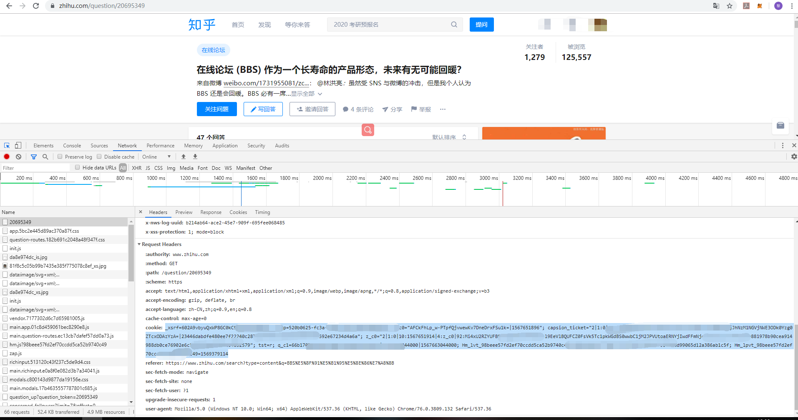

## 爬取知乎的图片和视频，知乎小姐姐，都到我的硬盘里来

### 用法

```
usage: zhf
 -aids <aids>   配置回答ID， 多个ID用','隔开
 -data <data>   配置数据存放路径，默认是data
 -help          打印帮助信息
 -qids <qids>   配置问题ID，多个ID用','隔开
 -url <url>     配置问题URL
```

例如：

```
java -jar zh-fetch-1.0-SNAPSHOT.jar -url https://www.zhihu.com/question/323389488/answer/679220600
```

在使用前，请登录知乎，并将登录后产生的cookie复制到放在jar包运行目录的cookie.txt文件里。
具体方法为打开知乎（使用Chrome），登录后，按F12，选择network，刷新页面，按照图片指示复制Cookie到cookie.txt文件中即可。


添加了Cookie之后，就可以愉快地把小姐姐下载到硬盘了。
